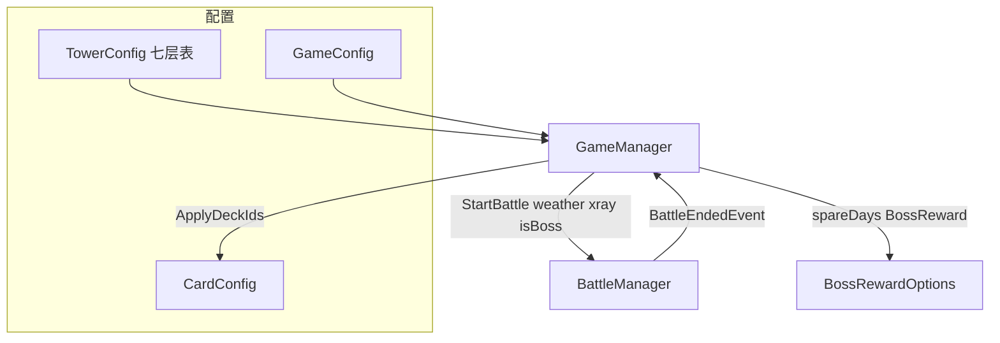

# Phase 3：塔系统逻辑实现计划

## 现状摘要（与文档对齐）

| 文档要点 | 代码现状 |
|---------|---------|
| 7 层、`MaxDaysPerFloor`、初始金/透视 | [`GameConfig`](Assets/Scripts/Configs/GameConfig.cs) + [`PlayerData`](Assets/Scripts/Models/PlayerData.cs) 已有字段 |
| 战斗内天气（烈日/冰雹/暖风） | [`CardBattleRules.GetEffectiveLevel`](Assets/Scripts/Core/Battle/CardBattleRules.cs)、[`BattleManager.StartBattleInternal`](Assets/Scripts/Managers/BattleManager.cs) 已实现 |
| 雨季金钱 +50% | **未接**：需在统一「加金币」入口乘系数 |
| 层进度、`FloorState`，进层/过日 | [`GameManager`](Assets/Scripts/Managers/GameManager.cs) 三个方法为空；[`DailyController`](Assets/Scripts/Controllers/DailyController.cs) 仅占位 |
| BOSS 卡组、驻守者 5 选 1 | **未实现**：战斗仍用 [`BuildDefaultEnemyDeck`](Assets/Scripts/Managers/BattleManager.cs) |

## 设计约定（避免歧义）

1. **本层天数 `FloorDay`**：进入新层时置 `0`；每调用一次 `AdvanceDay()`（确认结束当日）+1。  
2. **超时失败**：当 `FloorDay > GameConfig.MaxDaysPerFloor` 且本层 BOSS 尚未击败（[`FloorState.BossDefeated`](Assets/Scripts/Models/FloorState.cs) == false）时判定游戏失败（对应文档「超过 3 天未挑战 BOSS」——在本约定下等价于「未在允许天数内通关驻守者」）。  
3. **剩余天数用于驻守奖励**：BOSS 战胜当刻定义  
   `spareDays = max(0, MaxDaysPerFloor - FloorDay)`  
   （同日越早打败，`FloorDay` 越小，`spareDays` 越大 → 奖励档位越高；具体档位由配置表映射）。  
4. **BOSS 战与普通战**：通过新增战斗入口参数区分（见下），便于 [`BattleEndedEvent`](Assets/Scripts/Core/Events/GameEvents.cs) 回调里走驻守奖励分支。

## 架构数据流（概览）

## 实现任务

### 1. 塔配置资源（BOSS + 可选奖励池）

- 新增 [`TowerConfig`](Assets/Scripts/Configs/)（ScriptableObject）：包含 `id`、长度为 7（或与 [`GameConfig.TowerFloors`](Assets/Scripts/Configs/GameConfig.cs) 一致）的数组项，每项至少：`bossId`、`enemyDeckCardIds[]`、`npcIds[]`（与现有 [`FloorState`](Assets/Scripts/Models/FloorState.cs) 对齐）、可选 `rewardCardPoolIds[]`（驻守者 5 选 1 抽卡池，文档 §十 待定则用占位池）。  
- 新增 Addressable 标签常量（例如 [`AddressableLabels.ConfigTower`](Assets/Scripts/Core/AddressableLabels.cs)），在 [`ConfigManager.InitializeConfigsAsync`](Assets/Scripts/Managers/ConfigManager.cs) 中加载并索引（按 `CurrentFloor` 或数组下标取当前层）。  
- 在 [`KingCardsDefaultConfigsSetup`](Assets/Editor/KingCardsDefaultConfigsSetup.cs) 中生成占位 `Tower_Default.asset` 并打标签（与现有 Bootstrap 流程一致），避免运行时缺键。

### 2. GameManager：塔核心状态机

在 [`GameManager`](Assets/Scripts/Managers/GameManager.cs) 中实现（保持单例与 [`ServiceLocator`](Assets/Scripts/Core/ServiceLocator.cs) 注册方式不变）：

- 解析默认 [`GameConfig`](Assets/Scripts/Configs/GameConfig.cs)（取列表第一项或 id=`default`）。  
- **`StartNewGame()`**：按 `GameConfig` 重置 `PlayerData`（金、`CurrentFloor=1`、`CurrentDay=1`、`FloorDay=0`、`XRayCount=initialXRay`、`CurrentWeather` 初始值）；同步 `FloorState` 为塔配置第 1 层；可选调用一次每日天气滚动（见下）。  
- **`AdvanceDay()`**：`CurrentDay++`，`FloorDay++`；随后若 `Gold<=0` 或「`FloorDay > MaxDaysPerFloor` 且未击败 BOSS」则发布**游戏失败**事件并进入结束状态（避免重复推进）。  
- **`EnterNextFloor()`**：仅在当前层 `BossDefeated==true` 时允许；`CurrentFloor++`，`FloorDay=0`，`BossDefeated=false`，从塔配置写入新的 `BossId`/`NpcIds`；**透视 +1**（文档 §2.2.4）；若 `CurrentFloor > TowerFloors` 则视为**通关**（发布胜利事件或占位）。  
- **`AddGold(int delta)`**（或命名 `ApplyGoldChange`）：若为增收且 `CurrentWeather == Rainy`，按文档 §2.3 乘 `1.5f` 再取整；发布已有 [`GoldChangedEvent`](Assets/Scripts/Core/Events/GameEvents.cs)。  
- **`RollDailyWeather()`**（可在 `AdvanceDay` 末尾或 StartNewGame 调用）：从枚举 [`WeatherType`](Assets/Scripts/Models/Enums.cs) 均匀随机（或后续改为权重表）；更新 `PlayerData.CurrentWeather`；扩展 **`WeatherChangedEvent`** 携带 `WeatherType`（当前为无参结构体 [GameEvents.cs](Assets/Scripts/Core/Events/GameEvents.cs)），便于 UI 订阅。

辅助方法：`SyncFloorStateFromTower()` 根据 `PlayerData.CurrentFloor` 填充 `FloorState`。

### 3. BattleManager：BOSS 战与卡组来源

- 增加对外入口，例如 `StartBattleFromPlayerState(bool vsBoss)` 或 `StartTowerBattle(bool isBoss)`：  
  - `vsBoss==false`：保持现有默认敌方卡组行为（便于调试）。  
  - `vsBoss==true`：从当前层塔配置读取 `enemyDeckCardIds`，通过 `ConfigManager.TryGetCard` 转成运行时 [`Card`](Assets/Scripts/Models/Card.cs) 列表（与 `CloneForBattle` 路径一致）。  
- 内部可用字段 `_isBossBattle`，在 [`FinishBattle`](Assets/Scripts/Managers/BattleManager.cs) 发布 [`BattleEndedEvent`](Assets/Scripts/Core/Events/GameEvents.cs) 时**无法附带额外参数**——两种选一：  
  - **推荐**：新增 `BattleEndedEvent` 重载或增加可选字段 `IsBossBattle`（需同步所有订阅处，目前仅 [`BattlePanelView`](Assets/Scripts/Views/UI/BattlePanelView.cs)）；或  
  - 新增独立事件 `TowerBossBattleEndedEvent(bool victory, BattleEndReason reason)` 仅 BOSS 战发送。  
- BOSS 战胜且非逃跑：`GameManager` 侧设 `FloorState.BossDefeated = true`，调用驻守奖励生成（见下），**不**在 Phase 3 强制做完整 UI，仅发布事件携带 5 个选项数据。

### 4. 驻守者奖励（5 选 1）逻辑层

- 新增小型静态或服务类（如 `BossRewardPicker`）：输入 `spareDays`、`TowerFloorEntry` 的奖励池、`ConfigManager` 卡牌表；输出 **5 条选项**（每条为「金币数额」或「CardId + 展示名」的联合结构，可用简单 DTO + `JsonUtility` 友好字段）。  
- 档位规则占位：`spareDays` 越大，金币区间越高或池内高稀有度权重越大（具体数值表放在 `TowerConfig` 或独立 `Serializable` 字段，便于策划改）。  
- 发布事件例如 `BossRewardOfferedEvent(FloorIndex, BossRewardOption[] options)`，供后续 Phase 5/界面接入。

### 5. 与存档、DailyController 的衔接

- [`SaveData`](Assets/Scripts/Models/SaveData.cs) 已含 `Player` 与 `Floor`，无需新类型即可持久化塔进度；若增加事件负载以外的纯运行时标志，避免写入存档。  
- [`DailyController`](Assets/Scripts/Controllers/DailyController.cs)：最小改动为订阅 `DayChangedEvent`/`GameOver` 占位日志，或保留 TODO 注释指向 `GameManager.AdvanceDay`，避免空壳误导。

### 6. 手动验证建议（实现后）

- 新游戏 → `AdvanceDay` 连点直至 `FloorDay>MaxDaysPerFloor` 未杀 BOSS → 应失败。  
- 杀 BOSS（测试入口调用 BOSS 战并取胜）→ `BossDefeated`、奖励事件、`EnterNextFloor` 后层数与透视递增。  
- 切换 `Rainy` 后 `AddGold` → 增收为 1.5 倍取整。

## 刻意不在 Phase 3 展开的内容（避免范围膨胀）

- 商店 UI、打工流程（Phase 4）；完整 Buff/NPC（Phase 5）；成就（Phase 6）。  
- 驻守奖励**正式界面**仅预留事件与数据结构；[`BattlePanelView`](Assets/Scripts/Views/UI/BattlePanelView.cs) 可只做日志一行提示 BOSS 战结果（可选）。
