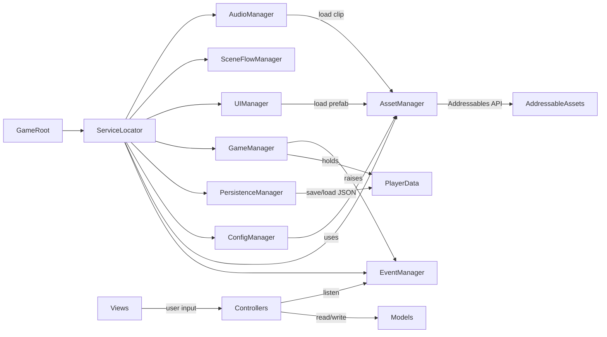

## 架构概览

采用 **MVC + Manager(Service)** 模式：

- **Model**：纯 C# 数据类，可序列化，不依赖 Unity API，存放运行时玩家/战斗状态
- **View**：`MonoBehaviour`，只负责显示与输入接收，通过事件向 Controller 通知
- **Controller**：纯 C# 类，编排 Model 与 View，调用 Manager
- **Manager**：跨场景常驻的 `MonoBehaviour` 单例，通过 `ServiceLocator` 统一注册/获取
- **Config**：`ScriptableObject`（卡牌、Buff、天气、全局参数），通过 **Addressables** 加载；对话/剧情 JSON 同样走 Addressables（`TextAsset` 形式）
- **Asset**：所有运行时资源（SO、UI 预制体、音频、对话 JSON）统一走 `AssetManager` 封装的 Addressables API，业务层不直接调用 `Addressables.LoadAssetAsync`




---

## 一、目录结构（一次性建立）

```
Assets/
├── Scripts/
│   ├── Core/
│   │   ├── ServiceLocator.cs
│   │   ├── Singleton/
│   │   │   ├── MonoSingleton.cs
│   │   │   └── PersistentMonoSingleton.cs
│   │   ├── Events/
│   │   │   ├── IEvent.cs
│   │   │   ├── EventBus.cs
│   │   │   └── GameEvents.cs
│   │   ├── MVC/
│   │   │   ├── IModel.cs
│   │   │   ├── IView.cs
│   │   │   └── IController.cs
│   │   └── GameRoot.cs
│   ├── Managers/
│   │   ├── GameManager.cs
│   │   ├── EventManager.cs
│   │   ├── PersistenceManager.cs
│   │   ├── AssetManager.cs
│   │   ├── ConfigManager.cs
│   │   ├── UIManager.cs
│   │   ├── SceneFlowManager.cs
│   │   ├── AudioManager.cs
│   │   └── BattleManager.cs
│   ├── Models/
│   │   ├── Enums.cs
│   │   ├── Card.cs
│   │   ├── PlayerData.cs
│   │   ├── BattleState.cs
│   │   ├── ShopState.cs
│   │   ├── FloorState.cs
│   │   ├── HistoryRecord.cs
│   │   └── SaveData.cs
│   ├── Configs/
│   │   ├── CardConfig.cs
│   │   ├── BuffConfig.cs
│   │   ├── WeatherConfig.cs
│   │   ├── ShopConfig.cs
│   │   └── GameConfig.cs
│   ├── Controllers/
│   │   ├── DailyController.cs
│   │   ├── BattleController.cs
│   │   ├── ShopController.cs
│   │   └── DialogueController.cs
│   ├── Views/UI/
│   │   ├── BaseView.cs
│   │   └── UIPanelId.cs
│   └── KingCardsSpire.asmdef
├── GameAssets/                  # Addressables 标记的可加载资源
│   ├── Configs/
│   │   ├── Cards/  Buffs/  Weathers/  Shop/  Game/
│   ├── UI/                      # UI 预制体
│   ├── Audio/                   # BGM / SFX 片段
│   └── Dialogues/               # 对话 JSON (TextAsset)
└── AddressableAssetsData/       # Addressables 自动生成的设置文件夹
```

理由：

- 所有运行时脚本放进同一个 `KingCardsSpire.asmdef`，依赖 `Unity.Addressables` / `Unity.ResourceManager` 程序集
- 不再使用 `Resources/`、`StreamingAssets/`，所有运行时资源统一放 `Assets/GameAssets/` 并加入 Addressables Group
- 资源 key 统一用路径风格字符串（如 `Configs/Cards/Card_King`），便于按 label 批量加载

---

## 二、核心框架文件

### 2.1 ServiceLocator + 单例

`Assets/Scripts/Core/ServiceLocator.cs`：

```csharp
public static class ServiceLocator {
    private static readonly Dictionary<Type, object> _services = new();
    public static void Register<T>(T service) where T : class { _services[typeof(T)] = service; }
    public static T Get<T>() where T : class => _services.TryGetValue(typeof(T), out var s) ? (T)s : null;
    public static void Unregister<T>() where T : class => _services.Remove(typeof(T));
    public static void Clear() => _services.Clear();
}
```

`MonoSingleton<T>` / `PersistentMonoSingleton<T>`：通用单例基类，后者带 `DontDestroyOnLoad`。所有 Manager 继承之。

### 2.2 事件系统

`Core/Events/EventBus.cs`：强类型订阅/发布。

```csharp
public interface IEvent {}
public class EventBus {
    private readonly Dictionary<Type, Delegate> _handlers = new();
    public void Subscribe<T>(Action<T> h) where T : IEvent { ... }
    public void Unsubscribe<T>(Action<T> h) where T : IEvent { ... }
    public void Publish<T>(T evt) where T : IEvent { ... }
}
```

`GameEvents.cs` 集中声明事件类型（占位空类）：`GameStartedEvent`、`DayChangedEvent`、`FloorChangedEvent`、`GoldChangedEvent`、`CardAcquiredEvent`、`BattleStartedEvent`、`BattleEndedEvent`、`WeatherChangedEvent`、`SaveLoadedEvent` 等，对应 [Plan.md](Doc/Plan.md) 的核心循环节点。

### 2.3 MVC 接口与启动入口

`IModel`/`IView`/`IController` 三个最小接口，规定生命周期方法（如 `Initialize`/`Dispose`）。

`Core/GameRoot.cs`：场景上唯一的根 `MonoBehaviour`，`Awake` 中按顺序 `new` 并 `Register` 全部 Manager，调用各自 `Initialize()`，最后 `Publish(new GameBootedEvent())`。

---

## 三、Manager 层（仅骨架，不写业务）

每个 Manager 都是 `PersistentMonoSingleton<T>`，构造时 `ServiceLocator.Register(this)`，`Initialize()` 留空 TODO。

- `**GameManager**`：持有 `PlayerData`、`FloorState`，对外暴露 `StartNewGame()`、`EnterNextFloor()`、`AdvanceDay()` 等空方法
- `**EventManager**`：包装 `EventBus`，转发 `Subscribe/Publish`，所有跨模块通信走它
- `**PersistenceManager**`：`Save(SaveData)` / `Load() : SaveData` / `HasSave()` / `Delete()`，使用 `JsonUtility` + `Application.persistentDataPath`，槽位预留多存档支持
- `**AssetManager**`：Addressables 的薄封装，统一异步加载/释放：
  - `UniTask<T> LoadAsync<T>(string key)`（无 UniTask 时用 `Task<T>` 或 `IEnumerator` + 回调）
  - `UniTask<IList<T>> LoadAllAsync<T>(string label)`（按 label 批量加载所有 SO）
  - `UniTask<GameObject> InstantiateAsync(string key, Transform parent)`
  - `Release(object handle)` / `ReleaseAll()`
  - 内部维护 `Dictionary<string, AsyncOperationHandle>` 防止重复加载并支持引用计数
- `**ConfigManager**`：启动时调用 `AssetManager.LoadAllAsync<CardConfig>("config_card")` 等按 label 批量加载，结果按 `id` 建字典；提供 `GetCard(id)`、`GetAllBuffs()` 等只读查询。**自身不直接调用 Addressables**
- `**UIManager`**：维护 `Stack<BaseView>` 面板栈，`Open<T>()` / `Close<T>()` / `CloseAll()`，UI 预制体通过 `AssetManager.InstantiateAsync(panelId.ToAddress())` 加载，预留 6.x 各 UI 区域 enum (`UIPanelId`)
- `**SceneFlowManager`**：封装 `Addressables.LoadSceneAsync`（场景也走 Addressables），定义场景枚举（`Boot/Main/Battle`）
- `**AudioManager`**：BGM / SFX 双 `AudioSource`，`PlayBgm(string key)` / `PlaySfx(string key)`，内部用 `AssetManager` 拉取 `AudioClip`
- `**BattleManager`**：`StartBattle(BattleConfig)` / `EndBattle(BattleResult)` 空方法，持有 `BattleState`，留待 Phase 2 填充

启动顺序（GameRoot 中固定）：`EventManager → AssetManager → PersistenceManager → ConfigManager(异步) → AudioManager → UIManager → SceneFlowManager → GameManager → BattleManager`，`ConfigManager.InitializeAsync()` 完成后才发布 `GameBootedEvent`。

---

## 四、数据模型（Models）

全部为 `[Serializable]` 纯 C# 类，对照 [Plan.md §8.2](Doc/Plan.md) 与各章节扩展：

- `**Enums.cs**`：`CardType { Basic, Function, Ability, Consumable }`、`WeatherType { Rainy, Sunny, Hail, WarmWind, Ending }`、`BuffId`、`SceneId`、`UIPanelId`
- `**Card.cs**`：`id / name / level / type / effectDesc / isUnique`，对应 §3 全部卡牌字段
- `**PlayerData.cs**`：覆盖 §8.2 + §2.1（`currentFloor / currentDay / floorDay / gold / handCards / discardPile / ownedCards / selectedBuff / xrayCount / currentWeather / unlockedDialogues / unlockedAchievements`）
- `**BattleState.cs**`：§8.2 BattleState 全字段 + `round / maxRound / turnHistory`
- `**ShopState.cs**`：每层独立商店的当日商品列表 + 已售空槽位标记（§4）
- `**FloorState.cs**`：当前层 BOSS、NPC 列表、是否已通关
- `**HistoryRecord.cs**`：每日行动记录（§6.2）
- `**SaveData.cs**`：聚合 `PlayerData / FloorState / ShopState / List<HistoryRecord>`，作为 `PersistenceManager` 序列化根

---

## 五、配置 ScriptableObject（Configs）

只建类与字段，资源文件后续由策划在 Inspector 创建：

- `**CardConfig**`：`id / displayName / level / type / icon(AssetReferenceSprite) / description / isUnique`
  - `icon` 字段用 `AssetReferenceSprite` 而非 `Sprite`，由 Addressables 按需加载，避免引用即加载整张图
- `**BuffConfig**`：对应 §2.4 的 10 个 Buff 字段
- `**WeatherConfig**`：天气名 + 效果描述 + 数值参数（§2.3）
- `**ShopConfig**`：每类商品数量与基础价格（§4.1）
- `**GameConfig**`：初始金币、塔总层数、每层最大天数、初始透视张数等全局常量

每个 SO 顶部加 `[CreateAssetMenu(menuName = "KingCardsSpire/Configs/...")]`。

---

## 六、Controller 与 View 占位

- `Controllers/` 下四个 controller 均为空类 + 构造注入 `EventManager / GameManager`，Phase 2 起逐个实现
- `Views/UI/BaseView.cs`：抽象类，定义 `Show()/Hide()/OnOpen()/OnClose()`、绑定 `UIPanelId`
- 不创建任何具体 UI 预制体或具体 View 实现（用户要求暂不写业务）

---

## 七、场景与启动

- 重命名 `SampleScene` → `Boot`，新建空 `GameObject "GameRoot"` 挂 `GameRoot.cs`
- 不创建额外场景，等具体业务阶段再加 `Main`、`Battle`

---

## 八、Addressables 配置约定

通过 `Window → Asset Management → Addressables → Groups` 在编辑器中创建以下 Group（后续阶段补充实际资源时按规范打标签）：

- `**Configs**`（Local，Pack Together）
  - label: `config_card` / `config_buff` / `config_weather` / `config_shop` / `config_game`
  - key 命名：`Configs/Cards/Card_King`、`Configs/Buffs/Buff_Socialite` ...
- `**UI**`（Local，Pack Separately）
  - label: `ui_panel`
  - key 命名：`UI/Panel_TopStatus`、`UI/Panel_Battle` ... 与 `UIPanelId` enum 一一映射
- `**Audio**`（Local，Pack Together by Label）
  - label: `audio_bgm` / `audio_sfx`
  - key 命名：`Audio/BGM/Main`、`Audio/SFX/CardFlip` ...
- `**Dialogues**`（Local，Pack Together）
  - label: `dialogue`
  - key 命名：`Dialogues/Floor1_Boss`、`Dialogues/NPC_King` ... 内容为 `TextAsset`(JSON)

仅在框架阶段建立 Group 与命名规范，**不导入实际资源**。

---

## 九、不做的事（明确边界）

- 不实现任何卡牌效果、AI、战斗判定算法
- 不实现 UI 预制体、美术资源、音频资源、对话 JSON 内容
- 不接入 DOTween / VContainer / UniTask 等第三方库（如团队后续要 UniTask 再补）
- 不写单元测试（框架阶段无意义业务）

---

## 十、验证方式

完成后在 Unity 中：

1. `Window → Package Manager` 中 `Addressables` 已安装且无报错
2. 打开 `Boot` 场景按 Play，`ConfigManager.InitializeAsync()` 完成后控制台输出 `GameRoot: all managers initialized` 与 `Configs loaded: 0 cards / 0 buffs ...`（资源为空属正常）
3. `ServiceLocator.Get<AssetManager>()` 等所有 Manager 均非 null
4. 项目编译零错误零警告，`KingCardsSpire.asmdef` 生效，`Addressables Groups` 窗口能看到 `Configs / UI / Audio / Dialogues` 四个空 group

