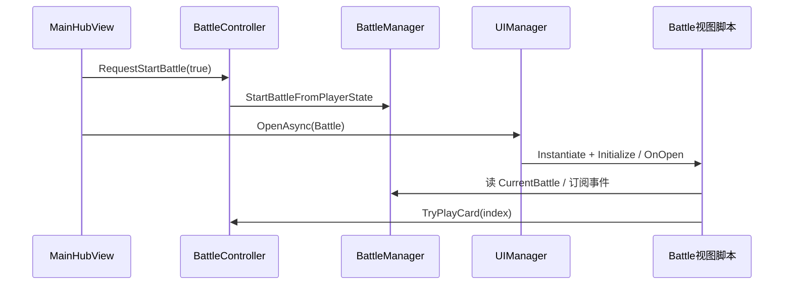

# 战斗界面跳转与逻辑接入方案

## 现状（无需从零搭跳转）

- [MainHubView.cs](Assets/Scripts/Views/UI/MainHubView.cs) 中 `OpenBossBattleRoutine()` 已实现：**先** `BattleController.RequestStartBattle(true)`，**再** `UIManager.OpenAsync(UIPanelId.Battle)`，与 [BattlePanelView.cs](Assets/Scripts/Views/UI/BattlePanelView.cs) 的 `OnOpen`（仅在未开战时补 `RequestStartBattle`）兼容。
- Addressables 键仍为 [`UI/Panel_Battle`](Assets/Scripts/Views/UI/UIPanelIdExtensions.cs)，当前条目指向 [Panel_Battle.prefab](Assets/GameAssets/UI/Panel_Battle.prefab)（挂旧版 `BattlePanelView`，并在运行时 `EnsureUiBuilt()` 动态生成控件）。
- 已存在示意图布局预制体 [BattleView.prefab](Assets/GameAssets/UI/BattleView.prefab)，但**尚未挂载战斗脚本**，且 [UI.asset](Assets/AddressableAssetsData/AssetGroups/UI.asset) 里 `UI/Panel_Battle` 未指向 `BattleView`。

## 目标行为（对齐示意图）

| 区域 | 数据来源 | 实现要点 |
|------|----------|----------|
| 左上「回合数 + 天气」 | `BattleState.Round`、`MaxRound`/`NoRoundLimit`、`BattleWeather` | 文案格式与 [MainHubView 天气中文](Assets/Scripts/Views/UI/MainHubView.cs) 一致（如「暖风」）；回合上限为暖风时用「无限制」或沿用现有 [BattlePanelView 头部逻辑](Assets/Scripts/Views/UI/BattlePanelView.cs)。 |
| 上中「对手名称」 | **新增**展示字段 | `BattleState` 增加 `OpponentDisplayName`，在 [BattleManager.SyncBattleState](Assets/Scripts/Managers/BattleManager.cs)（或开局时）根据是否 BOSS、`TowerFloorEntry.BossId`、`ConfigManager.TryGetCard` 解析显示名；非 BOSS 可用固定占位如「敌方」。 |
| 上方暗牌行 | `EnemyHand.Length` | 在敌方 `HorizontalLayoutGroup` 下 **实例化** `Card` 预制体，对 `CardView` 调用 **`SetScale(0.15f)`**，并进入背面模式、禁用点击；数量等于敌方手牌数。 |
| 下方明牌行 | `PlayerHand` + `CardConfig` | 实例化 `Card` 预制体，对 `CardView` 调用 **`SetScale(0.25f)`**；`CardViewModel.FromCard` + `ConfigManager.TryGetCard` 填字；`LoadCardArtFromConfig` 异步加载卡图（沿用 [CardView](Assets/Scripts/Views/UI/Cards/CardView.cs)）。点击出牌：`BattleController.TryPlayCard(handIndex)`。 |
| 「设置」「敌弃」「已弃」 | 按钮 | `SerializeField` 绑定；弃牌：`BattleState.PlayerDiscard` / `EnemyDiscard` 驱动简易列表（可由单独 `GameObject` 面板 + `ScrollRect`/多行 `Text` 构成，默认隐藏，按钮切换）。设置可先与 MainHub 一致打日志或预留回调。 |
| 关闭/返回塔内 | — | 保留关闭战斗面板：`UIManager.Close(UIPanelId.Battle)`（可选 SerializeField 按钮）。 |

### 手牌缩放（硬性约定）

- 预制体上的组件为 [`CardView`](Assets/Scripts/Views/UI/Cards/CardView.cs)，缩放 API 为 **`CardView.SetScale(float scale)`**（用户口述「Card.SetScale」即指该实例方法）。
- **敌方手牌**：每个实例在 `Apply` / `SetFaceDown` 等绑定完成后调用 **`SetScale(0.15f)`**。
- **己方手牌**：每个实例调用 **`SetScale(0.25f)`**。
- 常量建议在 `BattleView` 内 `private const float` 命名（如 `EnemyHandCardScale`、`PlayerHandCardScale`），避免魔法数散落。

## 代码改动（实施时）

1. **新建战斗视图脚本**（建议命名 `BattleView`，继承 `BaseView`）：SerializeField 绑定、事件订阅、`Refresh()`；玩家/敌方手牌重建时遵循上表缩放约定。

2. **扩展 [BattleState.cs](Assets/Scripts/Models/BattleState.cs)**：增加 `OpponentDisplayName`；在 [BattleManager](Assets/Scripts/Managers/BattleManager.cs) 开局 `SyncBattleState` 时赋值。

3. **扩展 [CardView.cs](Assets/Scripts/Views/UI/Cards/CardView.cs)**：新增背面模式 `SetFaceDown(bool)`，与 `SetScale` 调用顺序：通常先 `SetScale` 再 `Apply`，若背面布局依赖尺寸，以实际表现为准（必要时在 `SetFaceDown` 内不改动 scale）。

4. **天气文案**：抽取 `WeatherDisplay` 或与 MainHub 对齐映射。

5. **旧 [BattlePanelView](Assets/Scripts/Views/UI/BattlePanelView.cs)**：迁移完成后废弃或删除。

## Unity 编辑器侧操作

1. 在 **BattleView** 根物体挂载新脚本并拖拽绑定引用与 **Card** 预制体。
2. **Addressables**：地址 **`UI/Panel_Battle`** 指向 `BattleView.prefab`。

## 验证建议

- MainHub → Boss 战：双方手牌尺寸符合 0.15 / 0.25；出牌与结束流程正常。

## 风险与范围

- **回合显示语义**：`BattleState.Round` 为已完成回合数；若 UI 要显示「当前第几回合」可能用 `Round+1`，实施时与策划确认。
- **透视**：`EnemyVisible` 可选附加文本区，不阻塞主流程。
